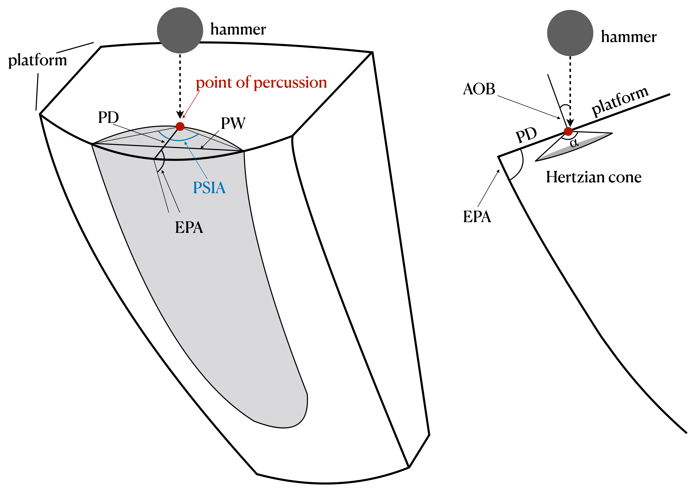

Introducing Platform Surface Interior Angle (PSIA) and Its Role in Flake
Formation, Size and Shape
================

<!--
This is the rMarkdown document used to create the manuscript
and its figures/tables.

It requires:
1) the png, tidyverse, retistruct, gridExtra and ggpubr libraries,
2) the data sets and two figures (datasets.zip),
3) the citations included here (bibliography.bib - also found in datasets.zip),
4) and the format file (plos.csl - also found in datasets.zip).
To compile this markdown document, place all these files in one folder and
either build with the rStudio interface or issue the following command:
rmarkdown::render('PSIA_Manuscript.rmd')

-->

# Introduction

There is considerable literature dedicated to understanding how flakes
form. This understanding has come from work following several broad
approaches including fracture mechanics (e.g. \[1–4\]), controlled
experiments (e.g. \[5–13\]), replicative experiments (e.g. \[14–16\]),
and attribute analysis of archaeological assemblages. These approaches
each have their own strengths and weaknesses; however, one way to think
about the differences among them is in the directionality of inference.
Fracture mechanics starts with first principles, or laws drawn from
physics and material sciences in particular, concerning how fractures
should form in brittle solids. These are then used to make predictions,
typically with explicit mathematical models, about how flakes should
look (size and shape) under varying conditions of force application and
solid material properties. These predictions are then typically tested
experimentally. To the contrary, controlled and replicative experiments
and studies of actual lithic assemblages look at empirical regularities
in flake size and shape under varying conditions of core preparation and
flaking (where the core is struck, the hammer type, how the platform is
prepared, the angle of strike, etc.). The observed outcomes are then
summarized as statistical models of flake formation. From these models
one can try to infer first principles, but for reasons discussed next,
this is usually not done. All of these approaches to understanding flake
formation are, of course, valid and useful. Ideally, what is learned
from actually doing (experiments) and what is learned from knowing how
it should work in principle (fracture mechanics) inform each other in an
iterative loop.

Understanding first principles causality from statistical modeling,
however, is challenging. McElreath \[17\] gives the example of trying to
understand the physics behind race cars by measuring their attributes.
Knowing the speed and handling characteristics of each car, eventually
the right things could be measured on each car to build statistical
models with enough predictive power to know how a new car might perform
in a race, but it would be quite difficult to infer the general physical
concepts (and laws) like torque, angular momentum, friction,
aerodynamics, conservation of energy, etc. from these statistical
models. Of course, with prior knowledge of the physics, finding the
right attributes to measure on the cars and statistical modeling are
more quickly and accurately done. This is important because even when
the physical laws are known, modeling them directly can be prohibitively
complex or computationally expensive (e.g. air resistance) whereas
experiments and statistical models can more efficiently arrive at
useable solutions.

The same is true of studies of flake formation and the role of fracture
mechanics within it. Fracture mechanics itself is a longstanding and
widely-applied field of study, but its practical application has been
extremely limited in our field, with the best examples coming from the
papers of Cotterell and Kamminga \[2,3\] and of Speth \[4,5\]. These
papers start with the physics of fracture mechanics in brittle solids to
then explain how flakes are formed and, therefore, why they vary. Some
attributes, like the bulb of percussion, are more easily accounted for
directly in fracture mechanics (e.g. Hertzian cone formation), whereas
for other attributes, like flake size and shape, the conceptual and
mathematical frameworks are provided by fracture mechanics. However, as
with the just mentioned example of air resistance, translating the
physics of how flakes are formed into a workable model that can predict
flake size and shape given the relevant parameters (e.g. core shape,
angle of blow, force of blow, etc.) has not come to pass (cf. \[4\]),
and it may not come to pass any time soon.

So instead, while some papers on controlled experiments in flake
formation may cite studies from fracture mechanics, their approaches are
all based on statistical modeling of the empirical relationships between
variables of flaking and flake outcomes. Speth’s work on this topic is a
good example. His 1972 paper uses fracture mechanics to derive a formula
to predict flake size which is then tested against a set of actual
flakes from a prehistoric site. By 1975 and again in 1981, Speth had
moved to experimental approaches (ball bearings on glass) and the
connection back to fracture mechanics had all but disappeared. Dibble
\[10\] goes further and dismisses fracture mechanics from the start as
nearly irrelevant. Instead of looking to fracture mechanics for insights
into what to study, experimental studies are being informed by
replicative knappers and observations on how actual lithic assemblages
vary. Dibble \[10,18\] is explicit in stating that his experimental
research is based on what knappers would have been able to control. In
these experiments, coming back to the race car analogy, we are carefully
building cars controlling for engine size, wheel configurations, foils,
etc., things that are generally thought to be important for making a car
go fast, and then measuring their speeds. Again, though, because it is
also difficult to go in the other direction (from statistical modeling
back to first principles), the controlled experiment papers have not
produced a general model of how flakes form. Instead, we have a series
of statistical models that are difficult to relate to one another
(e.g. \[19\]). Part of the difficulty stems from the fact that
different knapping variables are likely related in complex ways during
flake formation, yet their effects on flake variation are limited to a
similar set of size and shape attributes. For instance, Magnani et
al. \[19\] showed that changing the angle of blow, the location of
percussion and hammer hardness all result in similar flake attribute
variation. While regression models can capture the influence of these
individual knapping factors, reconciling them into a causal sequence of
flake formation remains challenging without the guidance of a general
model.

Illustration of several flake attributes discussed here. On the left is
a schematic semispherical core used in the Dibble and colleagues glass
experiments. On right is a schematic profile of the core through the
point of percussion.

The strongest and most influential model derived from controlled
experiments is the exterior platform angle and platform depth (EPA-PD)
model. The EPA-PD model states that flake size (weight) is primarily a
function of two important variables: exterior platform angle (EPA) and
platform depth (PD) (Figure 1). Increasing either of these variables
will increase flake size, but the relationship between the two is
geometric such that at higher values of EPA changes in PD have a greater
effect on flake size. The EPA-PD model has been replicated in multiple
ways, including experiments in the material sciences \[6–8,10,20,21\]
and in actual lithic assemblages (e.g. \[18,22,23\]). It is also argued
that in certain conditions, EPA-PD has a stronger effect on flake size
and shape than does core surface morphology \[11,24\]. The EPA-PD model
of flake formation, however, is constrained in what it can explain. For
instance, beveled flakes, where the volume behind the platform is
thinned, are not easily included into the model \[25\]. Beveled flakes
are typically larger (weight) than the EPA-PD models predicts given
their lower platform depths. The EPA-PD model also does not explain why
flake size and shape change with varying angles of blow and platform
shape \[9,19,26\]. It also does not account for flake width, which is
obviously a major component of shape. It is worth noting that while the
percentage of variability in weight explained by the EPA-PD model
(R2) is typically high in the Dibble glass experiments, it is
far lower in actual lithic assemblages \[26\]. It is low enough that its
utility for measuring retouch intensity (i.e. knowing how much mass has
been removed from a flake through retouch) is limited \[14,27–29\]. As a
result, there have been various proposals to improve the statistical
modeling of flake weight (or size) from different sets of measures
(e.g. \[28,30–32\]). Again, though, without a general model, it is not
really clear why one measurement technique should work better than
another. Because of this, the success of these models is measured by the
amount of empirical variation the models can account for
(i.e. R2 values) rather than against theoretical
predictions. This approach reflects the fundamental issue that our
knowledge of how flake formation works is still too limited to be
translated into measurable attributes. Instead, the majority of the
lithic attributes commonly measured by archaeologists are derived from
intuitive observations through actualistic flintknapping (i.e., when we
do x, flakes tend to show y). As Speth \[4\] noted nearly a half century
ago, how or even whether these attributes are indeed meaningful for
explaining flake variation are typically not justified *a priori* by
theoretical models of flake formation.

Here we propose to build on the EPA-PD model by 1) switching the focus
from variables controlled by the knapper to variables that might be more
directly related to flake initiation and formation and by 2) drawing
insights from the fracture mechanics literature. In particular, we start
with the principle that the Hertzian cone, the angle of which is known
from fracture mechanics to be a constant for a given raw material, has a
measurable impact on flake formation.

When a core is struck, the force of impact begins to produce a Hertzian
cone or “cone crack” at the point of percussion (see Figure 1B). The
Hertzian cone is the characteristic feature of Hertzian fracture and is
produced when a hard indenter is pressed onto the flat surface of a
brittle solid \[33–37\]. In three dimensions it forms a truncated cone
below the impact surface (see Figure 1B). In archaeology, Hertzian
fracture is often referred to as conchoidal fracture. While the size of
the Hertzian cone is dependent on variables such as the indenter’s
radius, the impact velocity and the fracture toughness of the brittle
solid, the cone angle remains unchanged \[38\]. The Hertzian cone angle
(sometimes referred to as the ‘included angle’ in fracture mechanics
literature) is the apex angle of the Hertzian cone. Though the
orientation of the Hertzian cone can be altered by changing the of angle
of blow \[36,38–40\], the apex angle remains constant for a given raw
material type \[41\]. A number of fracture mechanics studies have
demonstrated that the Hertzian cone angle is approximately 136° for soda
lime glass \[35–37\], the type of glass used by Dibble and colleagues
for their experiments. This value is also reported in Cotterell and
Kamminga \[2\]. The cone crack grows as force is transferred to the
core. Once the crack reaches a certain length, the crack’s propagation
path will no longer be Hertzian. At this point, instead of propagating
along the edges of the initial Hertzian cone, the crack continues almost
parallel to the core surface to form a flake \[1,2\]. Although the
Hertzian cone is only associated with the initial crack formation, the
angle of the cone leaves a marked effect on the ventral surface of the
flake near where it has been struck in the form of the bulb of
percussion.

Our prediction is that the constant Hertzian cone angle means that
platform width of a given flake is a function of where the core is
struck and where this angle intersects the platform edge. To show this
we present a new measure called platform surface interior angle (PSIA)
formed by the point of percussion and the extent of the platform width
(Figure 1A). We predict that this angle will be constant given that it
directly follows from the constant of the Hertzian cone angle. If our
prediction is correct, platform width (PW) can be incorporated into the
EPA-PD model and grounded in fracture mechanics via PSIA. This model
also has behavioral implications in that it may explain how the
manipulation of the platform impacts flake morphology.

To test this model, we examine several sets of flakes, including flakes
produced in the Dibble glass experiments and flakes from replication
experiments, using several methods to measure the PSIA. We find that the
mean angle in all datasets, regardless of how it is measured, is the
same (approximately 136 degrees) and quite consistent with above
mentioned values for Hertzian cone formation \[2\]. There is some
variability in the PSIA, and it is clear that this variability cannot be
solely attributed to measurement error. In the Dibble glass experiments,
where key variables are controlled, there is some indication that the
PSIA responds to the angle of blow. Our finding is consistent with all
of the empirical results of the Dibble experiments. More importantly,
PSIA explains some of the patterns in those data that previously were
unaccounted for. Once PSIA can be combined with the existing EPA-PD
model, we may have a model for flake formation that can explain a larger
portion of the variability we see in stone tool assemblages and that may
allow for a closer link to predictions coming from fracture mechanics.

# Materials and Methods

We examine the platform surface interior angle in three different
datasets. First, we examine glass flakes (n = 142) and cores coming from
the Dibble controlled experiments in flake formation \[9,19,22,24,25\].
This dataset has the advantage that a number of potentially important
variables are either controlled for or were measured. These include the
exterior platform angle, the angle of blow, the hammer type, raw
material, and metrics such as platform thickness, platform width, flake
length, width and thickness, and flake weight. Hereafter this dataset is
referred to as the *Dibble glass data*. Second, we attempt to replicate
the findings from the Dibble glass data by measuring the PSIA in a large
(n = 568) set of complete, unretouched flakes coming from 45 discrete
reduction sequences produced in replicative experiments by three
knappers who were naïve to the goals of this study. These flakes were
made with the intent of replicating various Middle and Upper Paleolithic
core reduction strategies from the initial decortification of the core
through to flake production and core maintenance \[42–45\]. These
replicative experiments used nodules of high-quality Bergerac and
Sénonien flint weighing from \~480–4100 g and coming from the southwest
region of France \[46\]. For each of the flakes coming from these
reduction series, the technology and the type of hammer (hard hammer,
soft hammer and indirect percussion) are known. Here we are interested
in the hard hammer flakes because these are comparable to the Dibble
hard hammer flakes, but we have included the soft hammer and indirect
percussion flakes in the results presentation for discussion purposes.
Today these flakes are stored in Campagne, France, and hereafter this
dataset is referred to as the *Campagne data* (see \[47\] for additional
details on the structure of this dataset). Third, in addition, we
measured a small set of flint flakes (n = 67) produced at the Max Planck
Institute for Evolutionary Anthropology in Leipzig, Germany, in the
context of teaching, replication, and experimentation. In this case, no
details are known about how the flakes were produced (e.g. hammer
types). This set of flakes is used here only to test a method for
measuring the PSIA. Hereafter this dataset is referred to as the *MPI
data*.

The methods used to measure the PSIA varied substantially between the
three datasets for practical reasons given the types of data available
to us and because we wanted to try different methods to begin to have
some idea of how best to measure this angle in future studies. First,
for the Dibble glass data, we used the following procedure. Dibble and
colleagues used several core forms, but the first and most common type
is what was called the semispherical core. This core (reproduced here in
Figure 2) looks like a loaf of bread with flat, squared off sides and
back, and a curved or domed flaking surface. An unworked example of this
core type was scanned using an NextEngine 3D laser scanner. The
resulting mesh was then processed in R to rotate the platform to be
perpendicular to the Z axis (or coincident with the XY plane). The XY
coordinates of the triangles forming the platform were then extracted
from this model and a convex hull fit to this cloud of points to have
the full outline of the platform on the Dibble semispherical cores (see
Figure 2). Next, we extracted just the portion of the outline that
includes where flakes are struck from these cores, and we fit a
polynomial curve to these points. Using the formula for this curve, we
created a series of equally spaced (in X) points along the platform edge
(see Figure 2). We then filtered the Dibble glass data to have only
flakes made from the semispherical cores by hard hammer. We include only
flakes with a feather termination, and we exclude flakes coming from
experiments on platform beveling \[25\] and so-called ‘on-edge’ core
strikes \[19\] (thereby arriving at our sample of n = 142). Knowing that
Dibble and colleagues tried to strike flakes from these cores at the
center or peak of the core surface curvature, we use the platform depths
reported for these flakes to position the point of percussion relative
to the set of platform edge outline points described above. Next, we
find the symmetrical pair of platform edge outline points, one to the
left and one to the right of the point of percussion, that yield a
platform width equal to the reported platform width for each flake.
Finally, the PSIA is calculated (arc-cosine of the dot product of two
normalize vectors) as the angle between the two line segments formed by
the left platform width point and the point of percussion and the right
platform point and the point of percussion. In the results presented
below, this angle is referred to as the *estimated* PSIA to indicate
that this angle is not directly measured from the flakes themselves.

We note that there are several potential sources of error in this
method. First, we are assuming that each flake was struck from the
center of the core. While this was the intention in the glass
experiments, there is certainly some error associated with this. Second,
we are assuming that the flake fracture plane is parallel to the core
surface and not twisted towards one lateral side or the other. To the
extent that either of these assumptions is invalid, it will impact the
angle calculation.

To verify the angles computed in this way from the Dibble glass data, we
also measure this angle directly with digital calipers and a goniometer
on a subset of these flakes. We use two methods of measurement to begin
to test how best to measure the PSIA by hand. In the first method, we
measure the three sides of the triangle formed by the two platform width
points and the point of percussion using digital calipers precise to .01
mm. Using standard trigonometric formulas, we then calculate the
interior angle of this triangle that corresponds to the PSIA as
described above. In the second method, we use a digital goniometer
precise to 0.1 degrees to record this angle. The joint of the goniometer
is positioned at the point of percussion and the jaws positioned to
cross the two platform width points. Both of these methods come with
possibilities for measurement error impacted by one’s ability to
pinpoint the point of percussion. In the Dibble glass flakes, because
the core edge is standardized, identifying the two platform width points
is fairly straightforward. However, in the goniometer method, taking the
measurement to these points while avoiding the curvature of the bulb of
percussion is not without some difficulties.

For the Campagne data, we use the following procedure. All of the flakes
were scanned using an Artec surface scanner. Each of the flake meshes
was then landmarked (see \[47\] for additional details on the scanning
and landmarking). For our purposes, three of these landmarks are
important: the two points (left and right) where the interior platform
intersects the core surface (i.e., the two ends of the platform width)
and the point of percussion. These three points are analogous with the
three points described above for computing the PSIA. This angle,
therefore, can be once again computed using the dot product of these two
line segments (specifically the arc-cosine of the dot product of the
normalize line segments). However, there is an important difference in
that, with the Dibble glass data, all computations are with two
dimensional line segments, while in the Campagne dataset the line
segments are in three dimensions. In the latter case, the angle is
computed in a two dimensional plane that is coincident with both line
segments, but we note this difference because it could introduce a
certain amount of incomparability in the two datasets. Our expectation
is that these angles could average larger than the Dibble glass data
because, for instance, lifting the point of percussion relative to the
two platform points would result in a larger PSIA.

Lastly, for the MPI data, we use only the goniometer method described
above. One of us (MW) made the measurements with instructions only on
the mechanics of the measurement. To avoid bias, MW was naïve to the
goals and results of this study. In the course of measuring the flakes,
several problematic platforms were identified where the measurement of
the PSIA was not as clear as the person selecting the flakes (SPM) had
initially believed. These flakes were removed from the analysis.

We use the R \[48\] statistical environment to do this analysis. This
paper is an rMarkdown document, and it is included in the supplementary
information along with the data files needed to compile the document and
replicate all of the figures, tables, and statistics. No permits were
required for the described study, which complied with all relevant
regulations.

# Results

Figure 3 shows the distribution of estimated PSIA in the Dibble glass
dataset. The distribution has a mean of 136.49±7.56. Variation in this
angle does not seem to be related to platform depth, exterior platform
angle or weight (Figure 4). There is a relationship between platform
width and the platform surface interior angle such that larger angles
result in wider platforms, which is to be expected (see Figure 4).

There also appears to be a relationship between the angle of blow and
the PSIA (Figure 5). While there are fewer cases with angles of blow
less than 20, there is some indication in the data that lower angles of
blow may be correlated with lower PSIA. However, once an angle of blow
is between 10-20 degrees or higher, the angle of blow is not correlated
with the PSIA.

Another way of looking at the relationship between platform width and
PSIA is to calculate what the platform width would be if the PSIA is a
constant and compare this to the actual platform width. We can do this
by placing the point of percussion on the same platform outlines as
above using the known platform depth for each of the flakes in the
Dibble glass data set. We then use the average PSIA computed above to
extend two vectors from this point of percussion to the platform edge.
Where these vectors intersect the platform edge defines the left and
right limits of the platform width. This estimated value for platform
width is then plotted against the actual, measured platform widths
(Figure 6).

Figures 7 and 8 show comparisons of the results of the estimated PSIA
presented above with direct measurements of this angle on a subsample of
49 of the 142 Dibble glass flakes in our analysis. For this sample, the
PSIA is 135.71±4.86. When measured with a digital goniometer the angle
is 133.44±4.61, and when measured with digital calipers and calculated
using trigonometry the angle is 135.86±8.85.

The distribution of the PSIA for the 568 flakes in the Campagne dataset
is shown in Figure 9. In the hard hammer flakes only, which is the
technique used in our subset of the Dibble glass dataset, the mean
platform surface interior angle is 140.36±12.38. Because data are
available for punch and soft hammer flakes, these are presented as well.
Punch flakes have a lower PSIA (126.53±11.01), and soft hammer flakes
have a mean of 138.94±15.69. The mean PSIA for all flakes in the
Campagne data set is 138.63±13.27.

In the Campagne data, PSIA does not covary with platform width, platform
depth or the shape of the platform (as measured by the ratio of platform
width to platform depth) (Figure 10). Though sample size is potentially
a problem, there is perhaps an indication that for larger platform
depths, there is less variability in the PSIA.

The distribution of PSIA in the MPI dataset as measured by a digital
goniometer is presented in Figure 11. This dataset contains `67` flakes,
and the mean is 137.75±10.97, in keeping with the other datasets.

# Discussion

Each of the datasets and measurement methods used to determine the PSIA
yielded very similar results, and these results are consistent with the
prediction based on the already known and constant angle of Hertzian
cones in soda lime glass (136°). While these results directly
incorporate platform width into the EPA-PD model of flake formation,
they also suggest that the existing model requires additional nuance.
All other things being equal, the relationship between PSIA and platform
width indicates that what determines the size of the flake is how far
into the core it is struck. Specifically, because of the constant PSIA,
the deeper into the core the flake is struck, the greater the platform
width will become (and the thicker the flake will become as well).
However, and this is the nuance, while platform depth is normally a good
proxy for how far into the core the flake is struck, it is not exactly
the same thing. What platform depth really measures is how far into the
*existing platform* of the core the flake is struck. Beveled flakes
illustrate this point.

Beveled flakes are ones where material is removed behind the platform
prior to striking the core. Dibble and colleagues recognized that
beveling altered the EPA-PD model of flake formation such that the
interaction of platform depth and exterior platform angle no longer
predicted flake size \[25\]. Beveled flakes have too thin a platform for
their size. However, PSIA helps explain this discrepancy and thereby
pulls beveled flakes back into an expanded EPA-PD model. To illustrate
this point, we examine some beveled flakes in the Dibble glass dataset.

In the Dibble glass dataset there are 11 flakes with flat or concave
beveling, coming from semispherical cores, and otherwise conforming to
our selection criteria. These are plotted in Figure 12 along with the
non-beveled flakes. It is clear that beveling changes the relationship
between platform depth and platform width. For a given platform width,
the beveled flakes have much shallower platforms (smaller PD) than
expected. As a result, the EPA-PD model underestimates their weight (see
Figure 12) as well. To illustrate the power of PSIA to model these
flakes, we build a linear model to estimate platform depth from the PSIA
and platform width in the non-beveled flakes in the Dibble glass
dataset. We then use this model to predict a platform depth for the
beveled flakes. However, given that the linear model requires PSIA to
predict platform depth and the actual PSIA is not known for these
flakes, we substitute in its place the average PSIA, as reported above
for the non-beveled flakes. When this is done, the predicted platform
depths for the beveled flakes plot on the same trend line as the
non-beveled flakes (compare red and blue points in Figure 12).

This modeled platform depth is then be used to improve the EPA-PD model
to give better estimates of flake size. The main aspect of size that
Dibble and colleagues have focused on with the EPA-PD model is weight,
and so we model flake weight as a function of EPA, platform depth and
the interaction of the two (see Figure 12). The cube root of weight is
used to correct for the different dimensions in the model. Next, we use
this same model to predict flake weight in the beveled flakes using the
platform depth as originally measured on these beveled flakes. In this
case, the modeled flake weights are much too low in comparison to their
actual weights (red points in Figure 12). Finally, we use the predicted
platform depth for the beveled flakes, as modeled above, to predict
flake weight again using the non-beveled flake model. In this case, the
flake weights plot in among the rest of the non-beveled flakes (blue
points in Figure 12). Thus the beveled flakes are the expected size when
we think of PD in the EPA-PD model not as a measure of platform depth
but rather as a measure of how far into the core the flake is struck,
which then determines the flake width via the PSIA given the shape of
the platform edge. Beveling does not change the expected size of these
flakes when flake formation is viewed this way.

![Platform depth to platform width including beveled flakes (red) and
non-beveled flakes (black) (top). Estimated points in blue are the same
beveled flakes but with the platform depth predicted using the average
PSIA and their actual platform width. At the bottom, the actual flake
weight is compared to the predicted flake weight based on an EPA-PD
model for non-beveled flakes (points in black). The predicted weight
using the actual (w/o PSIA) and the modeled (with PSIA) platform depths
for the beveled flakes are then plotted as well in red and blue
respectively.](PSIA_Manuscript_files/figure-gfm/fig12-bevel_with_estimated_pd-1.png)

There is some indication in the Dibble glass data that the angle of blow
may impact the PSIA. As mentioend earlier, at low angles of blow (with 0
degrees representing an angle of blow perpendicular to the platform, see
Figure 2 in \[19\]), the PSIA is below average, and it appears to
increase until the angle of blow reaches between 10 and 20 degrees (from
perpendicular) after which the PSIA remains essentially unchanged (see
Figure 5). With the caveat that the Dibble glass data set has very few
cases with angles of less than 20 degrees, the fracture mechanics
literature suggests a relationship like this: the angle of blow changes
the direction, though not the size, of the Hertzian cone such that
flakes struck from cores with a high angle of blow (oblique strike)
should have “steeper and less prominent cones and less salient bulbs of
percussion than flakes which are struck more steeply \[or more
perpendicular\]” (\[4\], page 38). Experimentally, Magnani et al. \[19\]
also find a relationship between these variables. In their case, a
negative angle of blow (here values less than 0 meaning a strike
directed into the interior of the core rather than towards the core
surface) results in smaller bulbs relative to the weight of the flake.
In our Campagne data set, we see a difference between flakes made from
direct hard-hammer percussion and those made with a punch technique. The
latter cluster at the low range of PSIA. This difference could be
interpreted as reflecting a difference in the angle of blow in that
punch flakes are more likely to be struck perpendicularly to the
platform surface (an angle of blow of 0). More work needs to be done, in
particular in analyzing the Dibble glass data set where angle of blow is
well controlled, but we suggest that increasing the angle of blow has
the effect of tipping the direction of the Hertzian cone such that it
intersects the core surface not as a circle but rather as an ellipse.
This is a phenomenon that has been repeatedly documented in fracture
mechanics \[36,38,40\]. Although the angle of the cone itself remains
unchanged, its intersection with the surface broadens and results in
higher PSIA. Thus, if this suggestion is correct, striking a core with a
high angle of blow will result in a larger platform width for a given
platform thickness.

The direct measurement of PSIA in a subsample of the Dibble glass flakes
shows that our method for finding this angle using the platform surface
shape and platform depth is working. However, there is variability in
this angle depending on how it is measured. With the caveats that only
one person measured these flakes and that the sample is small, in
general it seems that the direct measurement with a goniometer performs
better than the indirect calculation of the angle from three caliper
measurements. Of the two methods, the caliper measurements show greater
variability than do the goniometer measurements. The caliper method can
also fail completely when measurement error produces a triangle with
impossible side lengths (e.g. the sum of the two shorter sides is less
than the length of the longest side). Importantly too, this is only
knowable once the measures are taken and an angle is calculated, making
it much more difficult to correct, whereas the goniometer method
produces an angle each time. Our study, however, does not indicate which
of the three methods in this case is correct, nor do we know the error
associated with any of these individual methods. Now that PSIA seems to
produce results relevant to understanding flake formation, additional
studies are required to better know the error distribution on an
individual measure. We note too that this error distribution will likely
vary with the angle itself, the size of the point of percussion, and
other factors that remain to be identified. The question, however, is
whether this measurement error will overwhelm patterns, such as, for
instance, showing a potential correlation in angle of blow and PSIA. It
is our expectation that with a digital goniometer, direct measurement of
the PSIA can become one of the standard measurements within lithic
attribute analysis, but this remains to be determined.

We note that our finding that the PSIA varies around a constant derived
from fracture mechanics appears to be consistent with all of the
findings to date of the Dibble glass experiments \[9,19,22,24,25\].
Additionally, it perhaps helps explain or account for one of the more
counter-intuitive findings of the glass experiments, namely that flake
size (weight) is not impacted by the force with which the core is struck
\[9\]. In the EPA-PD model, the amount of force required to remove a
flake given a particular combination of EPA-PD is a constant (see also
\[20\]). Subtracting force means that the flake is not initiated. Adding
force does not change the size of the resulting flake. This makes sense
in the PSIA addition to the model. In fracture mechanics, it is known
that striking a material harder will change the size of the Hertzian
cone but not the angle \[35\]. Thus when a given core is struck, how far
into the core the Hertzian cone can travel will depend on the hammer
size and the striking force, but where the cone will intersect the core
surface does not change. So striking a Dibble glass core harder at a
particular point does not change the platform width, and as a result,
the subsequent fracture plane that removes the flake has much less
freedom to change the size of the flake. This said, we note that a
recent study \[40\] shows that increasing impact velocity of the
indenter will eventually cause the Hertzian cone angle to decrease (see
also \[49\]). The question is whether these velocities are relevant to
stone knapping.

# Conclusions

Fracture mechanics is a massive field of study with both great potential
and great difficulties for understanding flake formation. The potential
is that the physical laws and models coming from fracture mechanics are,
ultimately, how the actions of knappers are translated to the removal of
usable flakes. The difficulties are both inherent to the field of
fracture mechanics itself and to the complexity of the problem (some
solutions require more time and computing power than exists). There are
also difficulties related to the challenges of interdisciplinary work
where the equations and goals of one field are terribly difficult to
bring into another. This later point is clearly seen in the early
fracture mechanics literature and the minimal impact it has had on
experimental and replicative studies of flake formation.

This said, our goal here was to return to this literature and to try to
find some useful insights that could be translated to a better
understanding of the underlying mechanisms (or first principles) of
flake formation and that might thereby lead to a better integration of
the various statistical models currently in use. To do this, we switched
from the existing focus in the experimental literature on what knappers
do to instead focus on attributes that may be more directly related to
fracture mechanics. Thus we focused our attention on the Hertzian
percussion cone as a constant and investigated whether it could help
explain platform width, an aspect of flake size and shape that up to now
has been absent from the dominant EPA-PD model of flake formation. We
measured three different collections in multiple different ways and
found that in each case the angle formed by the platform width and the
point of percussion to be, on average, essentially the same as what is
predicted from fracture mechanics for the angle of the Hertzian cone.

We conclude that the platform surface interior angle or PSIA is an
important determinant in flake size and shape. While it would seem that
it is a constant and not under direct control by the knapper, the
knapper is (unknowingly) exploiting the properties of this angle when
preparing the platform and its contact with the core surface and when
deciding how far into the core to strike. In fact, this angle underlies
a knapper’s ability to visualize the extent of the striking platform
prior to removing a flake. In our model, this is how the PD side of the
EPA-PD model of flake formation is translated into a flake of a
particular size and shape. In other words, it is not the PD that
directly structures flake size but rather PD is proxy for how far into
the core a flake is struck which then, through the effect of platform
surface interior angle on platform width, structures the size and shape
of the flake.

This, however, requires further testing, particularly with beveled
flakes where PD, without PSIA, performs poorly as a proxy for how far
into the core a flake is struck. If the PSIA performs better in these
circumstances, as the preliminary data presented here suggest (see
Figure 11), then we will have improved the EPA-PD model and helped to
integrate what are now disparate studies \[9,25\]. Additionally, while
our study shows that the average PSIA conforms well to predictions from
fracture mechanics for Hertzian flake formation, it is still clear that
there is variability around this mean. Given that there is certainly
some chaos in flake formation, we are not sure how much variability to
expect. For instance, sometimes the Hertzian cone crack may kink at a
light angle to continue expanding, and this kink may contribute to the
variability observed in PSIA \[50,51\]. However, it is also clear that
the model does not work at all for some flakes. It may be the case that
these flakes are not formed by Hertzian mechanisms (e.g. bending flakes)
and that alternative models will be required in these cases. Clearly
more experiments and more data are required to begin to understand which
kinds of flakes fail the PSIA model presented here, and these flakes
will require additional insights into models of flake formation.

# Acknowledgements

Michel Brenet and Laurence Bourguignon produced the Campagne data set,
and we thank them for allowing us access to this important collection.
Claudio Tennie provided feedback on the ideas and comments on the
manuscript. SPM, MW, WA, ZR and TD thank Jean-Jacques Hublin for his
continued support of our research agenda. Sadly Harold Dibble died
before the main findings of this paper were discovered. Without his
vision and his efforts to build a data set of flakes made under
controlled conditions, this paper would not have been possible. We
dedicate this paper to him.

# Supplemental Information

**S1 File. PSIA\_manuscript.rmd.** rMarkdown file of this document.

**S2 File. datasets.zip.** Compressed file containing data files,
figures, bibliography and format file.

# References

1\. Cotterell B, Kamminga J, Dickson FP. The essential mechanics of
conchoidal flaking. International Journal of Fracture. 1985;29: 205–221.

2\. Cotterell B, Kamminga J. The formation of flakes. American
Antiquity. 1987; 675–708. 

3\. Cotterell B, Kamminga J. The mechanics of flaking. In: Hayden B,
editor. Lithic Usewear Analysis. New York: Academic Press; 1979. pp.
97–112. 

4\. Speth JD. Mechanical basis of percussion flaking. American
Antiquity. 1972; 34–60. 

5\. Speth JD. Experimental investigations of hard-hammer percussion
flaking. Tebiwa. 1974;17: 7–36. 

6\. Speth JD. Miscellaneous studies in hard-hammer percussion flaking:
The effects of oblique impact. American Antiquity. 1975;40: 203–207. 

7\. Speth JD. The role of platform angle and core size in hard-hammer
percussion flaking. Lithic Technology. 1981;10: 16–21. 

8\. Dibble HL, Pelcin A. The Effect of Hammer Mass and Velocity on Flake
Mass. Journal of Archaeological Science. 1995;22: 429–439. 

9\. Dibble HL, Rezek Z. Introducing a new experimental design for
controlled studies of flake formation: Results for exterior platform
angle, platform depth, angle of blow, velocity, and force. Journal of
Archaeological Science. 2009;36: 1945–1954. 

10\. Dibble HL, Whittaker JC. New experimental evidence on the relation
between percussion flaking and flake variation. Journal of
Archaeological Science. 1981;8: 283–296. 

11\. Pelcin AW. The effect of core surface morphology on flake
attributes: Evidence from a controlled experiment. Journal of
Archaeological Science. 1997;24: 749–756. 

12\. Pelcin AW. The effect of indentor type on flake attributes:
Evidence from a controlled experiment. Journal of Archaeological
Science. 1997;24: 613–621. 

13\. Pelcin AW. The formation of flakes: The role of platform thickness
and exterior platform angle in the production of flake initiations and
terminations. Journal of Archaeological Science. 1997;24: 1107–1113. 

14\. Davis ZJ, Shea JJ. Quantifying Lithic Curation: An Experimental
Test of Dibble and Pelcin’s Original Flake-Tool Mass Predictor. Journal
of Archaeological Science. 1998;25: 603–610.
doi:[10.1006/jasc.1997.0255](https://doi.org/10.1006/jasc.1997.0255)

15\. Eren MI, Lycett SJ. Why Levallois? A Morphometric Comparison of
Experimental “Preferential” Levallois Flakes versus Debitage Flakes.
PLOS ONE. 2012;7: e29273.
doi:[10.1371/journal.pone.0029273](https://doi.org/10.1371/journal.pone.0029273)

16\. Mourre V, Villa P, Henshilwood CS. Early Use of Pressure Flaking on
Lithic Artifacts at Blombos Cave, South Africa. Science. 2010;330:
659–662.
doi:[10.1126/science.1195550](https://doi.org/10.1126/science.1195550)

17\. McElreath R. Sizing up human brain evolution. 2018; 496–497.
doi:[doi: 10.1038/d41586-018-05197-8](https://doi.org/doi:%2010.1038/d41586-018-05197-8)

18\. Dibble HL. Platform variability and flake morphology: A comparison
of experimental and archaeological data and implications for
interpreting prehistoric lithic technological strategies. Lithic
technology. 1997;22: 150–170. 

19\. Magnani M, Rezek Z, Lin SC, Chan A, Dibble HL. Flake variation in
relation to the application of force. Journal of Archaeological Science.
2014;46: 37–49. 

20\. Chai H, Lawn BR. Edge chipping of brittle materials: Effect of
side-wall inclination and loading angle. International Journal of
Fracture. 2007;145: 159–165. 

21\. Dogandžić T, Abdolazadeh A, Leader G, Li L, McPherron SP, Tennie C,
et al. The results of lithic experiments performed on glass cores are
applicable to other raw materials. Archaeological and Anthropological
Sciences. 2020;12: 44. 

22\. Lin SC, Rezek Z, Braun D, Dibble HL. On the utility and
economization of unretouched flakes: The effects of exterior platform
angle and platform depth. American Antiquity. 2013;78: 724–745. 

23\. Režek Ž, Dibble HL, McPherron SP, Braun DR, Lin SC. Two million
years of flaking stone and the evolutionary efficiency of stone tool
technology. Nature Ecology & Evolution. 2018; 1.
doi:[10.1038/s41559-018-0488-4](https://doi.org/10.1038/s41559-018-0488-4)

24\. Rezek Z, Lin S, Iovita R, Dibble HL. The relative effects of core
surface morphology on flake shape and other attributes. Journal of
Archaeological Science. 2011;38: 1346–1359. 

25\. Leader G, Abdolahzadeh A, Lin SC, Dibble HL. The effects of
platform beveling on flake variation. Journal of Archaeological Science:
Reports. 2017;16: 213–223. 

26\. Clarkson C, Hiscock P. Estimating original flake mass from 3D scans
of platform area. Journal of Archaeological Science. 2011;38: 1062–1068.

27\. Shott MJ, Bradbury AP, Carr PJ, Odell GH. Flake Size from Platform
Attributes: Predictive and Empirical Approaches. Journal of
Archaeological Science. 2000;27: 877–894.
doi:[10.1006/jasc.1999.0499](https://doi.org/10.1006/jasc.1999.0499)

28\. Dogandžić T, Braun DR, McPherron SP. Edge Length and Surface Area
of a Blank: Experimental Assessment of Measures, Size Predictions and
Utility. PLOS ONE. 2015;10: e0133984.
doi:[10.1371/journal.pone.0133984](https://doi.org/10.1371/journal.pone.0133984)

29\. Hiscock P, Tabrett A. Generalization, inference and the
quantification of lithic reduction. World Archaeology. 2010;42: 545–561.

30\. Archer W, Pop CM, Rezek Z, Schlager S, Lin SC, Weiss M, et al. A
geometric morphometric relationship predicts stone flake shape and size
variability. Archaeological and Anthropological Sciences. 2018;10:
1991–2003. 

31\. Braun DR, Rogers MJ, Harris JW, Walker SJ. Quantifying variation in
landscape-scale behaviors: The oldowan from koobi fora. In: Lycett S,
Chauhan P, editors. New perspectives on old stones: Analytical
approaches to paleolithic technologies. New York, NY: Springer New York;
2010. pp. 167–182.
doi:[10.1007/978-1-4419-6861-6\\%0087](https://doi.org/10.1007/978-1-4419-6861-6\\%0087)

32\. Muller A, Clarkson C. Estimating original flake mass on blades
using 3D platform area: Problems and prospects. Journal of
Archaeological Science. 2014;52: 31–38. 

33\. Chen S, Farris T, Chandrasekari S. Contact mechanics of Hertzian
cone cracking. International journal of solids and structures. 1995;32:
329–340. 

34\. Frank FC, Lawn B. On the theory of Hertzian fracture. Proceedings
of the Royal Society of London Series A Mathematical and Physical
Sciences. 1967;299: 291–306. 

35\. Kocer C, Collins RE. Angle of Hertzian cone cracks. Journal of the
American ceramic Society. 1998;81: 1736–1742. 

36\. Lawn B, Wilshaw T, Hartley N. A computer simulation study of
Hertzian cone crack growth. International Journal of fracture. 1974;10:
1–16. 

37\. Roesler F. Brittle fractures near equilibrium. Proceedings of the
Physical society section B. 1956;69: 981–992. 

38\. Chen L-Y, Chaudhri MM. Influence of tangential stress on the impact
damage of soda-lime glass with spherical projecticles. 18th Intl
Congress on High Speed Photography and Photonics. 1989. p. 955. 

39\. Akimune Y. Oblique impact of spherical particles onto silicon
nitride. Journal of the American Ceramic Society. 1990;73: 3607–3610. 

40\. Chaudhri MM. Dynamic fracture of inorganic glasses by hard
spherical and conical projectiles. Philosophical Transactions of the
Royal Society A: Mathematical, Physical and Engineering Sciences.
2015;373: 20140135. 

41\. Fischer-Cripps AC. Introduction to contact mechanics. Springer;
2007. 

42\. Brenet M, Bourguignon L, Folgado M, Ortega I. Élaboration d’un
protocole d’expérimentation lithique pour la compréhension des
comportements techniques et techno-économiques au Paléolithique moyen.
Les nouvelles de l’Archéologie : Programmes expérimentaux et
taphonomiques. 2009; 60–64. 

43\. Brenet M, Bourguignon L, Folgado M, Ortega I. Elaboración de un
protocolo de experimentación lítica para la comprensión de los
comportamientos técnicos y tecno-económicos durante el Paleolítico
Medio. In: Morgado Rodríguez A, Baena Preysler J, editors. La
investigacion experimental aplicada a la arqueologia. Ronda, Malaga:
Galindo, SL; 2011. pp. 77–85. 

44\. Bourguignon L, Brenet M, Folgado M, Ortega I. Aproximación
tecno-económica del debitage Discoide de puntas pseudo-Levallois: El
aporte de la experimentación. In: Morgado Rodríguez A, Baena Preysler J,
editors. La investigacion experimental aplicada a la arqueologia. Ronda,
Malaga: Galindo, SL; 2011. pp. 53–59. 

45\. Ortega Cordellat I, Locht J-L, Soressi M, Ríos Garaizar J,
Bourguignon L, Blaser F, et al. La producción laminar durante el
Paleolítico Medio en el norte y sudoeste de Francia: El aporte de la
experimentación. In: Palomo A, Piqué R, editors. Experimentación en
arqueología Estudio y difusión del pasado. Museu d’Arqueologia de
Catalunya; 2013. pp. 219–228. 

46\. Turq A, Dibble H, Faivre J-P, Goldberg P, McPherron SJP, Sandgathe
D. Le Moustérien Récent Du Périgord Noir : Quoi De Neuf ? In: Jaubert J,
Bordes J-G, Ortega I, editors. Les Sociétés du Paléolithique dans un
Grand Sud-ouest de la France: Nouveaux gisements, nouveaux résultats,
nouvelles méthodes. Mémoire de la Société Préhistorique Française 48;
2008. pp. 83–94. 

47\. Archer W, Djakovic I, Brenet M, Bourguignon L, Presnyakova D,
Soressi M, et al. Quantifying differences in hominin flaking
technologies with 3D shape analysis. 

48\. R Core Team. R: A language and environment for statistical
computing. Vienna, Austria: R Foundation for Statistical Computing;
2018. 

49\. Wang X-e, Yang J, Liu Q-f, Zhang Y-m, Zhao C. A comparative study
of numerical modelling techniques for the fracture of brittle materials
with specific reference to glass. Engineering Structures. 2017;152:
493–505. 

50\. Hu S, Chen Z, Mecholsky JJ. On the Hertzian fatigue cone crack
propagation in ceramics. International journal of fracture. 1996;79:
295–307. 

51\. Marimuthu KP, Rickhey F, Lee H, Lee JH. Spherical indentation
cracking in brittle materials: An XFEM study. 2016 7th International
Conference on Mechanical and Aerospace Engineering (ICMAE). IEEE; 2016.
pp. 267–273. 

